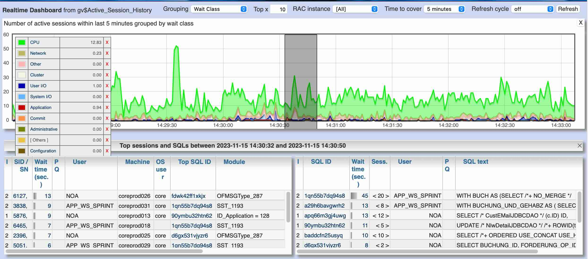

OPMS for Oracle-DB
========

Web-tool for analyzing performance issues of Oracle databases.<br/>
Provides easy access to several current and historic state information of Oracle DBs.<br>



## Installation / Usage
there are two ways to run OPMS:
1. as Java program (jar file)
2. as Docker container

### 1. Use OPMS as Java program (jar file)
- Ensure you have Java installed (version 21 or higher)
- Start the application by executing the jar file in a terminal:
  ```
  > java -jar OPMS.jar
  ```
- Open the application in your browser: http://localhost:8080
- Login with an Oracle user of the chosen database 

### 2. Use OPMS as container
- Ensure you have Docker or Podman installed
- Run the application by executing the following command in a terminal:
  ```
  > docker run -p 8080:8080 docker.io/rammpeter/OPMS
  ```
- Open the application in your browser: http://localhost:8080
- Login with an Oracle user of the chosen database

## License
This application is available free of charge under the terms of the [GNU General Public License](http://www.gnu.org/licenses/gpl-3.0).
